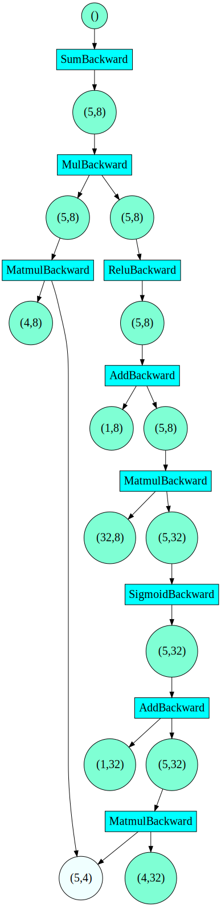

# ToyTorch
[](LICENSE)

This project was created as a practice exercise while I was learning about neural network with PyTorch. To deepen my understanding, I wrote some test code to mimic PyTorch's behavior. Over time, this evolved into a simple neural network framework. I made it available for anyone who wants to quickly grasp the concepts by playing with it. 

Please note that efficiency was not prioritized. The main goal is ease of understanding. Treat it as a toy and enjoy!

## **Features**
To keep it simple, I targeted only the `float` data type and `cpu` device. (Pytorch supports different data types and devices through a dispatcher mechanism which I haven't tried yet). 

Current features include:
- **A Tensor class**
- **Tensor creators**
  - empty, zero, ones, rand, randn
    
- **Basic Tensor operations**
  - matmul
  - add, sub, mul, div, pow, exp, neg, abs, sign, sum, mean
  - where, select, transpose, cat, squeeze, unsqueeze, view
  - gt, ge, lt, le, strict_equal, strict_allclose
    
- **Modules**
  - Linear, Conv2d
    
- **Activation function**
  - Sigmoid, Relu

- **Loss function**
  - smooth_l1_loss
    
- **Autograd mechanism**
  - Dynamic update the backward graph if the tensor requires_grad=True
  - Support basic operations matmul, add, sub, mul, div, pow, where, view
    
- **Optimizer**
  - SGD
    
- **Debug**
  - Output backward graph in DOT format

## **Build**
Since my environment is c++20, I used a bit features of it. But it should be very simple to fix it if you want to build with prior version. Building unit tests need `GTest`. You can skip it by addding `-DBUILD_TESTS=OFF`.

Enter the root fold and run
```
cmake -B build    // Add -DBUILD_TESTS=OFF if you want to skip building the unit tests
cmake --build build
```
Two binaries will be created:
```
./build/src/linear_regression  // linear regression example provided by pytorch implemented using our toy
./build/test/toytorch_test   // unittests if you have built it
```
Run them to check the results.

## **Example**
- [linear regression example](./src/linear_regression_example.cpp)
- Backward graph printing example

```c++
#include "toytorch.h"

using namespace toytorch;
int main() {
  Linear fc1(4, 32, "Sigmoid", "fc1");
  Linear fc2(32, 8, "Relu", "fc2");
  Tensor custom_param = randn({4, 8}, true);

  Tensor input = rand({5, 4});

  Tensor output1 = fc1.forward(input);  // (5, 32)
  output1 = fc2.forward(output1);       // (5, 8)

  Tensor output2 = matmul(input, custom_param); // (5, 8)
  Tensor result = (output1 * output2).sum();

  std::cout << debug::print_backward_graph(result) << std::endl;
  result.backward();

  // Print the gradient of each parameter after backward()
  fc1.weights().grad()->print();
  fc1.bias().grad()->print();
  fc2.weights().grad()->print();
  fc2.bias().grad()->print();
  custom_param.grad()->print();

  return 0;
}
```
Here's the backward graph printed.



## **What to do next**

As you can see, we only have a skeleton here. We are missing a dataloader, a model saver, and most of the necessary operations required to support even basic use cases. After becoming familiar with it, you can try adding more features as you like. You can aim to support the [MNIST](https://github.com/pytorch/examples/blob/main/cpp/mnist/mnist.cpp) example as a starting point. Things you can do:
- Adding more operations
- Improving the performance by adding multithread, OpenMP or BLAS
- Adding python binding for fun

## **Resources**

Besides the official documents, thanks for the amazing blogs from ezyang. I've learned a lot from it. 

- [ezyang’s blog](http://blog.ezyang.com/category/pytorch/)
- [PyTorch resources](https://github.com/pytorch/pytorch/tree/main?tab=readme-ov-file#getting-started)

## **Communication**
[Filing an issue](https://github.com/fedom/ToyTorch/issues)

## **License**
This project is licensed under the MIT License. See the [LICENSE](./LICENSE) file for details.
